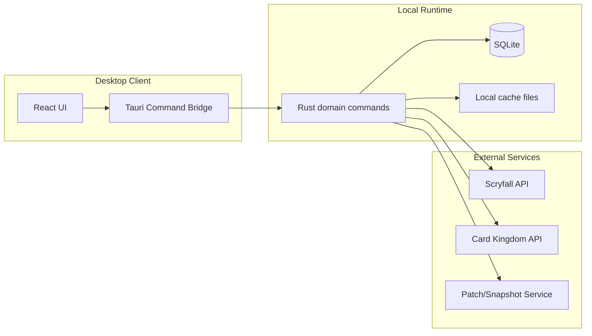
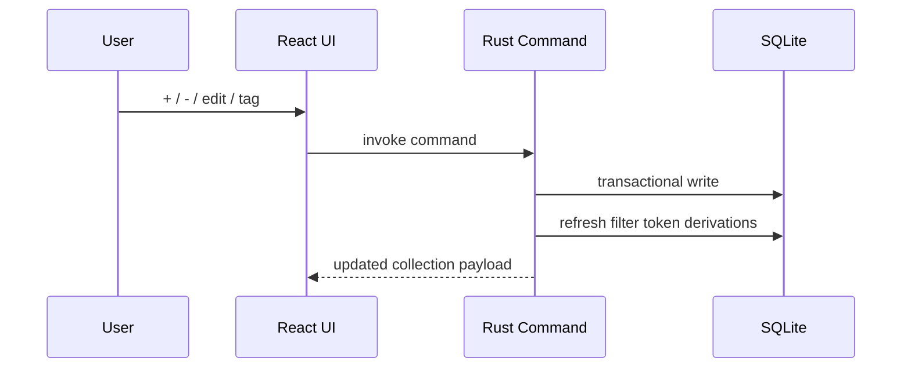
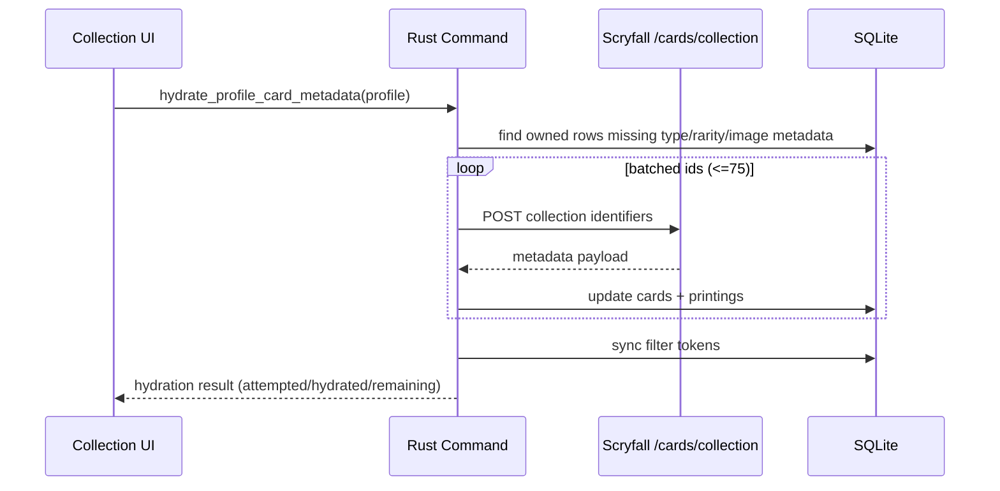
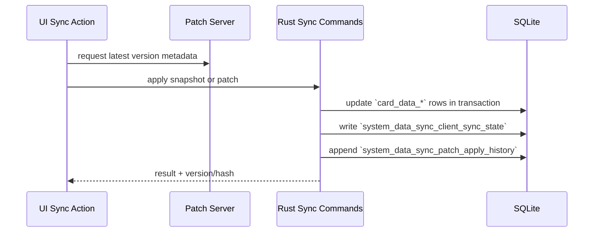

# MagicCollection Architecture

Last updated: 2026-02-10
Status: Alpha desktop-first, local-first architecture

## Executive Summary

MagicCollection is currently a desktop app focused on speed and offline reliability.

- UI: React + TypeScript
- App runtime: Tauri (Rust bridge)
- Data: local SQLite
- Providers: Scryfall + Card Kingdom public buylist
- Sync model: server-produced snapshot/patch artifacts applied locally

The long-term goal is shared contracts so desktop, web, and mobile all use the same data semantics.

## Architecture Map

## Runtime Layers

| Layer | Tech | Responsibility |
|---|---|---|
| Presentation | React 19 + TypeScript + Vite | Collection, Market, Reports, Settings UI and interaction logic. |
| Desktop shell | Tauri v2 + `@tauri-apps/api` | Windowing, native command invoke, packaging. |
| Domain/service | Rust (`src-tauri/src/lib.rs`) | Profile CRUD, collection mutation, metadata hydration, pricing, sync apply. |
| Persistence | SQLite (`rusqlite`) | Source of truth for `collection_data_*`, `card_data_*`, and `system_data_sync_*`. |
| Local sync tooling | Python `sync-service` | Build daily artifacts (snapshots, patches, compacted patches). |
| Upstream providers | Scryfall, CK public API | Card metadata/images + buylist market data. |

## Core Flows

## 1) Collection mutation flow

## 2) Metadata hydration flow (Scryfall)

## 3) Catalog sync flow

## Current Project Boundaries

In scope now:
1. Desktop UX and local-first reliability.
2. Fast collection operations for large inventories.
3. Search/filter quality (Scryfall-style plus human-friendly autocomplete).
4. Patch-ready local catalog sync model.

Deferred intentionally:
1. Cloud-hosted auth and account sync.
2. Full web/mobile deployment.
3. Multi-provider commercial pricing orchestration beyond initial adapters.

## Data Boundaries

- Local canonical store: SQLite (`magiccollection.db`).
- Browser/local dev fallback: lightweight localStorage only where desktop runtime is unavailable.
- External provider data is cached and normalized before entering UI state.

Related deep-dive:
- See `DATABASE_SCHEMA.md` for table/column details and ER mapping.

## Dependency Summary

## Frontend (`magiccollection-desktop/package.json`)
Runtime:
1. `react`
2. `react-dom`
3. `@tauri-apps/api`

Tooling:
1. `vite`
2. `typescript`
3. `eslint` and `typescript-eslint`
4. `@vitejs/plugin-react`
5. `@tauri-apps/cli`

## Backend (`magiccollection-desktop/src-tauri/Cargo.toml`)
Core:
1. `tauri`
2. `tauri-plugin-log`
3. `serde`, `serde_json`
4. `log`

Data and identity:
1. `rusqlite` (bundled SQLite)
2. `uuid`
3. `chrono`
4. `sha2`

Network:
1. `reqwest` (blocking + rustls)

## Sync tooling (`sync-service`)
1. Python runtime.
2. Local HTTP server script for artifact serving.
3. Optional Cloudflare scaffold exists but not required for prototype phase.

## Deployment Modes

## Mode A: Desktop-only
- Run Tauri app.
- All state local.

## Mode B: Desktop + local sync server
- Run `sync-service` pipeline/server locally.
- Desktop consumes local patch/snapshot endpoint.

## Planned Evolution (After prototype)

1. Extract shared contracts from desktop into `shared-core` for reuse.
2. Add hosted sync endpoint and artifact distribution.
3. Add cloud account linking on top of offline local auth.
4. Reuse same domain contracts for web and mobile clients.

## Engineering Conventions

1. Windows-first workflows for development and packaging.
2. Keep `CHANGELOG.md` and `NEXT_STEPS.md` updated after each major feature batch.
3. Prefer transactional DB operations and deterministic sync outcomes.
4. Keep comments concise and focused on non-obvious behavior.
