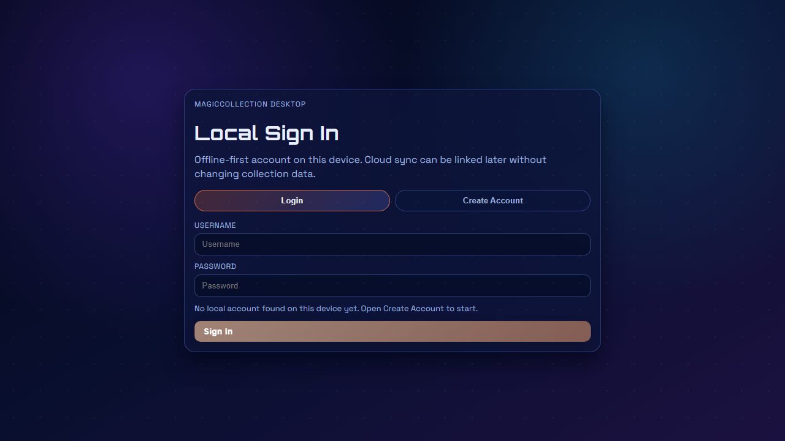
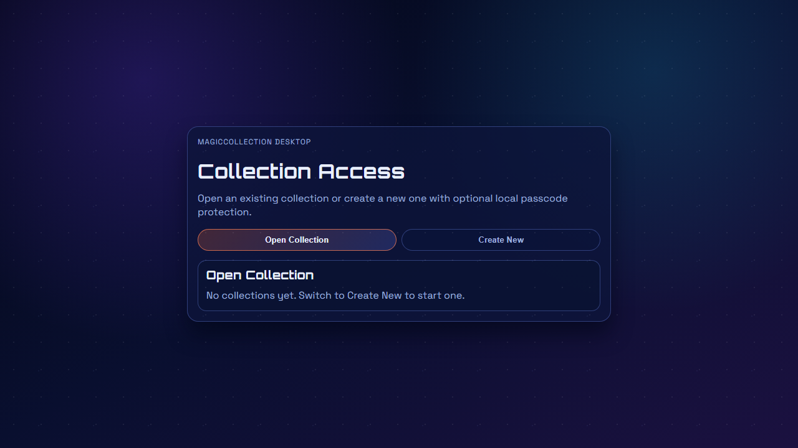
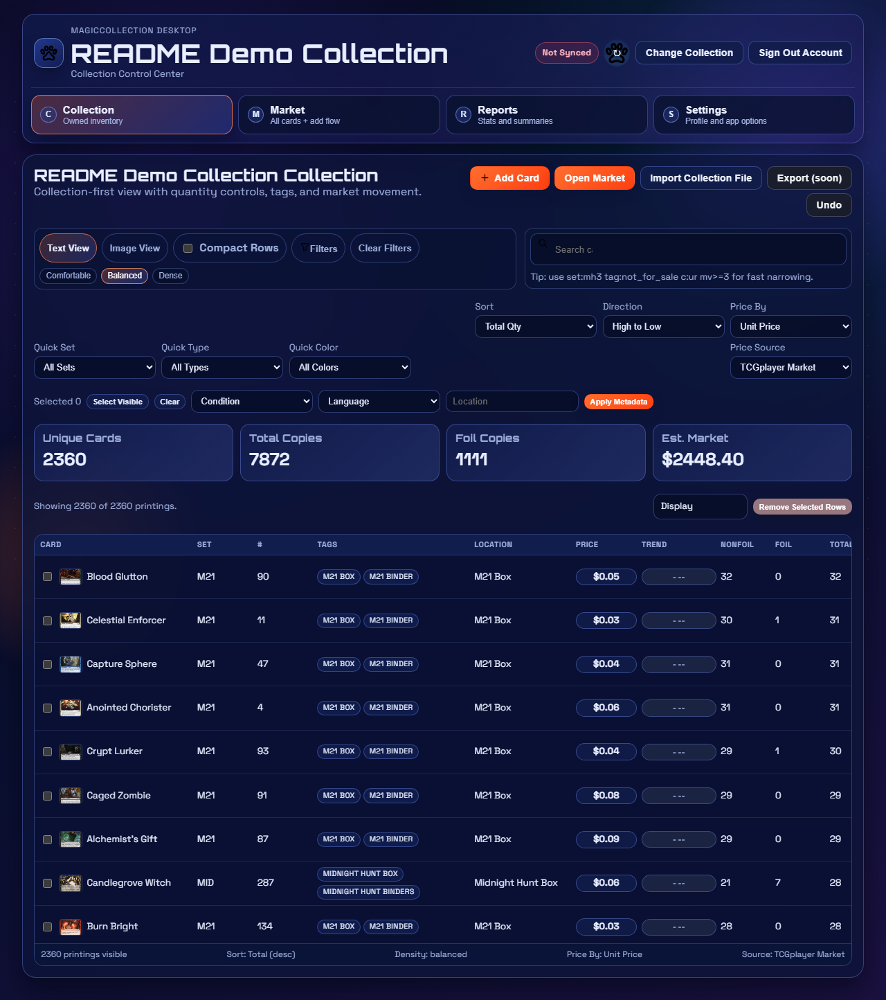
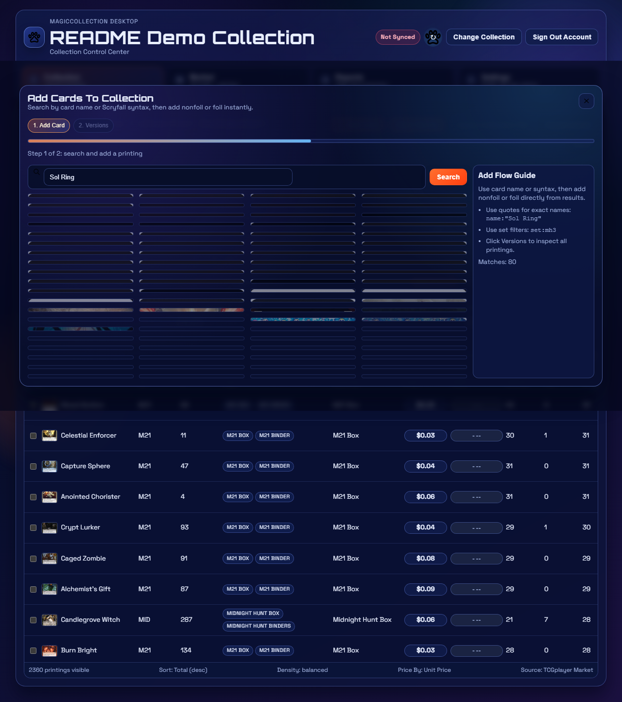

# MagicCollection

Desktop-first MTG collection and market tracker being built to compete with tools like Archidekt in speed, depth, and usability.

## Scope

MagicCollection is a local-first application that combines:

- Collection management (large inventory, fast add/remove/edit, tags/locations/metadata)
- Market data tracking (multi-source pricing, trends, refresh/sync flow)
- Search and filtering (Scryfall-style syntax + app-native filter UX)
- Import tools (flexible delimited import wizard with mapping/preview)

Current focus is the **desktop prototype** (`Tauri + React + TypeScript + SQLite`).
Web/mobile and hosted sync services are planned after desktop behavior is stable.

## Current Feature Areas

- Local auth and collection access gates (offline-capable)
- Collection table/image views with sorting/filtering and metadata editing
- Add-card modal and version exploration flow
- Import wizard for CSV/TSV/TXT with configurable delimiter + column mapping
- SQL-backed backend runtime for profile, collection, metadata, tags, and pricing records
- Sync plumbing for Scryfall metadata plus external pricing integrations

## Feature Screenshots

### 1. Local Sign In


### 2. Collection Access (Open/Create)


### 3. Collection Overview


### 4. Add Card Modal


### 5. Image View


### 6. Import Wizard


## Data + Runtime Notes

- Primary card/oracle metadata source: **Scryfall**
- Pricing sources in-progress: **TCGTracking** and **Card Kingdom**
- Local DB: SQLite (schema and migration details in `DATABASE_SCHEMA.md` and `SQL_MIG.md`)

## Windows Dev Workflow

From `magiccollection-desktop`:

```powershell
scripts\win-npm.cmd install
scripts\win-npm.cmd run tauri:dev
```

## Documentation Index

- Architecture: `ARCHITECTURE.md`
- Database reference: `DATABASE_SCHEMA.md`
- SQL transition notes: `SQL_MIG.md`
- Frontend/backend/SQL call map: `docs/FRONTEND_BACKEND_SQL_MAP.md`
- Next planned work: `NEXT_STEPS.md`

## Changelog

The full release/change history is maintained in:

- `CHANGELOG.md`

README is now scope + feature overview; changelog remains canonical in its own file.

